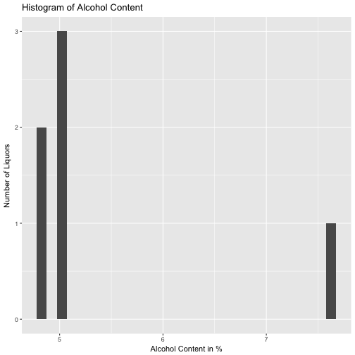

## Information

- Programming Assignments of Coursera.com online course: Developing Data Products

- This is a reproducible pitch presentation about a Shiny application, which can be tested on https://aaninab.shinyapps.io/developingdataproductweek4/.

- The according code can be found on GitHub https://github.com/aaninab/Developing-Data-Products.

- The data can be found on https://www.opendatabc.ca/dataset/bc-liquor-store-product-price-list-current-prices.


--- .class #id 

## The App

- This application shows a distribution of the alcohol content of liquor. It is filtered per country and per liquor type within a given price range.

- Additionally, the underlying data is shown with detailed information in a table below.

- One can choose between four different type of liquors and three countries. Plus, the price range can be defined individually.

- It can occur that no plot is shown. In that case no data is available.

--- .class #id 


## Histogram of Alcohol Content - Plot

The following plot shows a histogram of alcohol content for the country Germany, the liquor type Beer and within a price range of 5 Euro up to 50 Euro.


--- .class #id 


## Histogram of Alcohol Content - Code


```r
# Load the data of the British Columbia Liquor Store into a variable 
bcls <- read.csv("BC_Liquor_Store_Product_Price_List.csv", stringsAsFactors = FALSE) 
# Filter the data to reduce number of lines in the data sets
bcls_filt <- bcls %>%
             filter(
               CURRENT_DISPLAY_PRICE >= 5,
               CURRENT_DISPLAY_PRICE <= 50,
               PRODUCT_COUNTRY_ORIGIN_NAME == "GERMANY",
               PRODUCT_CLASS_NAME == "BEER"
             )
# Draw the histogram with ggplot and name the axis and title
q <-ggplot(data = bcls_filt, aes(x = PRODUCT_ALCOHOL_PERCENT)) + 
      geom_histogram() + 
      ggtitle("Histogram of Alcohol Content") + 
      xlab("Alcohol Content in %") + 
      ylab("Number of Liquors")
```


